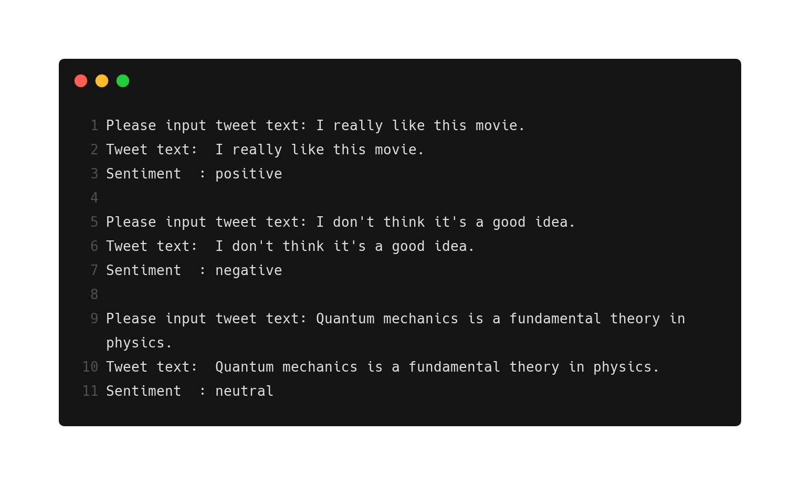

# Tweets Sentiment Analysis


Sentiment analysis is one of the most topic in Natural Language Processing (NLP). Helping machine to understand the sentiment in human language may benefit other NLP research as well. I am interested in building NLP pipeline and workflow to solve all kinds of real-life problems that relate to language technologies. I tend to include sentiment analysis as one of the key session in the NLP pipeline since it could serve as an important information for tasks like, conversational AI or question-answering  system. I have found out that, in many cases, including extensive sentiments for the language data as the meta-information or sub-information may increase the model performance. 

I use this repository to train and test various sentiment analysis model for NLP tasks. You can compare the performance between neural networks based modal or statistical machine learning based model, and establish baselines to improve upon it. 

This repository consists with Python file and Jupyter Notebook. You can run the Python file to preprocess the data, train the model and perform inference from the command line. The Jupyter Notebook is mainly for interactive exploratory data analysis.



## Dataset Information:

The dataset is mainly consists with a "tweet text" field and a "sentiment" field.

The sentiment field is dived into three categories: "positive", "negative" and "neutral".

The dataset for this task can be extensive and adaptive.


## Requirements:

For the model construction part, I use PyTorch as the main machine learning library. 

Run the below command to install the required dependencies for this project.

```shell
pip install -r requirements.txt
```


## Training 

There is a sample [model file](https://github.com/zymlnlp/Tweets-Sentiment-Analysis/blob/master/model/best_model_state.bin) in the [model](https://github.com/zymlnlp/Tweets-Sentiment-Analysis/tree/master/model) folder mainly for the usage of demo. 

You can also train the model by yourself using different hyper-parameter (e.g. learning rate, number of epochs, etc.) in order to generate better performance. The hyper-parameter can be defined through the command line, and it is also accessible through the [train.py](https://github.com/zymlnlp/Tweets-Sentiment-Analysis/blob/master/code/train.py) file in the [code](https://github.com/zymlnlp/Tweets-Sentiment-Analysis/tree/master/code) folder.

In addition, you can use your preferred sentiment analysis dataset to train the model for your task. Make sure you modify the code or adapt your preferred dataset in consist with the dataset in this project.

```shell
python ./code/train.py 
```


## Inference & Demo

You can interact with the sentiment analysis model through the below command line in your terminal.

Before you run the inference file, please check if you have download the [model file](https://github.com/zymlnlp/Tweets-Sentiment-Analysis/blob/master/model/best_model_state.bin) and make sure it is located in the [model](https://github.com/zymlnlp/Tweets-Sentiment-Analysis/tree/master/model) folder.

Note: It could take a while to load the model depends on the hardware you are using.

```shell
python ./code/inference.py
```

 

## Exploratory Data Analysis

If you want to explore the dataset in details, you can find a [EDA Jupyter Notebook](https://github.com/zymlnlp/Tweets-Sentiment-Analysis/blob/master/data_analysis/Tweet_Sentiment_Exploratory_Data_Analysis.ipynb) in the [data_analysis](https://github.com/zymlnlp/Tweets-Sentiment-Analysis/tree/master/data_analysis) folder.

Going through the dataset in-depth will help you to build better model. 


## Others

Please feel free to post feedbacks on the [Issues](https://github.com/zymlnlp/Tweets-Sentiment-Analysis/issues) section. 

I will be constantly maintaining this repository for further practical and research purposes.


